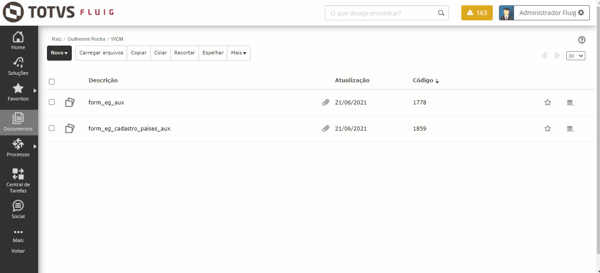
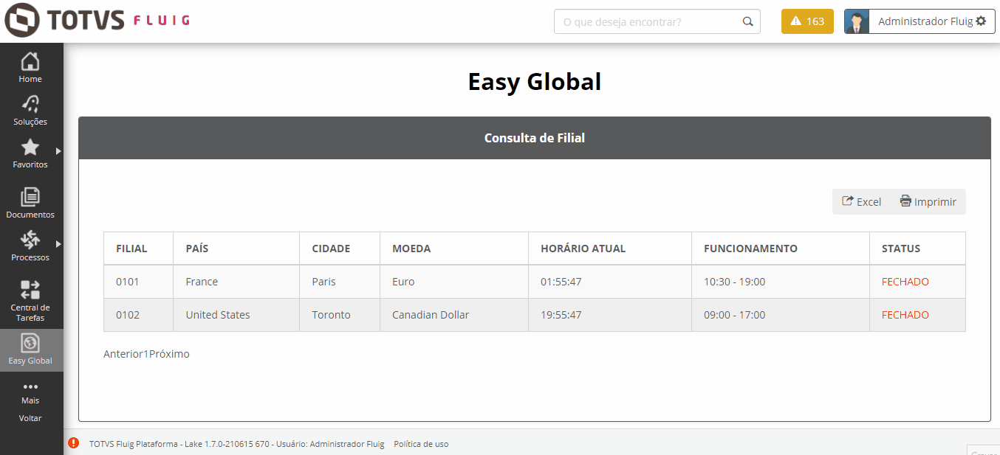
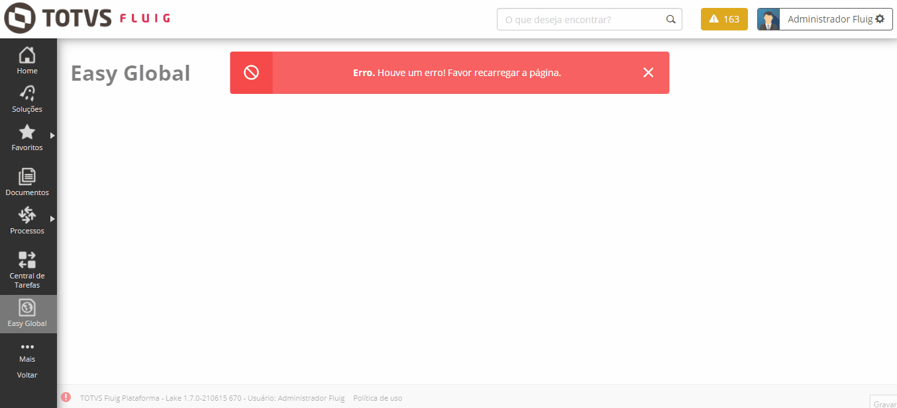

<h1 align="center">
Easy Global | Connecting your business

</h1>

## ℹ️ Sobre o que se trata?

O projeto trata-se de uma ferramenta para facilitar a comunicação de duas ou mais filiais de uma única empresa, pensando no seguinte caso, como exemplo, para ilustrar a aplicação: 

<em><h4>A empresa "Exemplo LTDA" possui 3 filiais (uma na França, outra nos Estados Unidos e a última no Reino Unido), então o funcionário "João Exemplo da Silva" necessita entrar em contato com a filial francesa, porém o mesmo gostaria de saber se a filial encontra-se aberta (baseado no horário de localidade do próprio funcionário), então o mesmo consulta a aplicação para exibir as informações necessárias que irão sanar sua dúvida, além de poder obter outras informações adicionais sobre as outras filiais da empresa.</h4></em>

<h2>:exploding_head:Funcionamento</h2>

No ambiente Fluig, inicialmente o usuário que possui acesso aos Documentos, cadastra um <b>único registro</b> dos <b>países da empresa</b> no formulário auxiliar do "Cadastro dos países", depois o mesmo necessita cadastrar no formulário auxiliar do "Cadastro filiais", um <b>único registro</b> inserindo informações sobre o <em>número da filial, continente em que a filial está localizada, cidade em que a filial está localizada e o horário de funcionamento da filial</em>. Note que o país em que a filial pertence é puxada através do preenchimento do formulário auxiliar <b>anterior</b> (Cadastro dos países), conforme anexo abaixo:

	:spiral_notepad: É bastante importante ressaltar que é necessário respeitar os seguintes padrões para que a requisição da API dos países venha de maneira correta:
<ul>
<li>Os nomes dos países necessitam estar escritos no idioma inglês;</li>
<li>Na hora do preenchimento do "horário de funcionamento", necessita respeitar o seguinte formato: 
 
"00:00 - 00:00"</li>
  <li>Para saber mais sobre a API utilizada, consulte este <a target="_blank" href=https://timezoneapi.io/>link</a>.</li>
  </ul>
  

No anexo abaixo é possível visualizar a tabela contendo as duas filiais preenchidas anteriormente, nela é mostrada as informações preenchidas pelo usuário do Fluig, além de mostrar uma coluna que exibe o horário atual no país em que a filial está cadastrada e uma outra coluna que exibe o status da filial de acordo com o horário de funcionamento: 

Abaixo é possível observar uma tratativa de retorno dos dados da API, onde ao falhar, é solicitado ao usuário para que o mesmo recarregue a página até de fato a aplicação retornar os dados.

## 🚀 Tecnologias Utilizadas
<ul>
<li>HTML</li>
<li>CSS</li>
<li>Bootstrap</li>
<li>JavaScript</li>
<li>jQuery</li>
<li>DataTables</li>
:warning: Tecnologias Necessárias
<ul>
<li>Ambiente com o Fluig instalado (no desenvolvimento foi utilizado a versão Lake 1.7)</li>
</ul>

</ul>
 

Enjoy it! 👽

